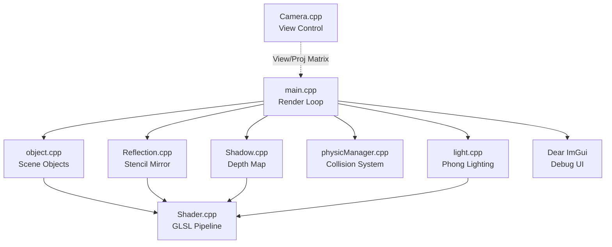

# 3D Reflection

[](https://isocpp.org/)
[](https://www.opengl.org/)
[](https://cmake.org/)

> A real-time 3D rendering engine built with C++ and OpenGL, featuring planar reflection, shadow mapping, AABB/OBB collision detection, and Phong lighting — all rendered through a custom shader pipeline with ImGui debug controls.

## Introduction

3D Reflection is a graphics programming project that tackles the core rendering challenges of a modern real-time engine. It addresses the problem of **visual fidelity in interactive 3D scenes** by implementing physically grounded techniques such as planar reflection via stencil buffer, shadow mapping with a depth framebuffer, and dual bounding-volume collision systems (AABB and OBB).

Built with a modular C++ architecture, each subsystem (lighting, reflection, shadow, physics, object management) is encapsulated into its own class, keeping the rendering loop in `main.cpp` clean and extensible.

## Table of Contents

- [Getting Started](#getting-started)
  - [System Requirements](#system-requirements)
  - [Prerequisites](#prerequisites)
  - [Quick Start](#quick-start)
  - [Manual Build (Without CMake GUI)](#manual-build-without-cmake-gui)
  - [Troubleshooting](#troubleshooting)
- [Key Features](#key-features)
- [Architecture](#architecture)
- [Rendering Techniques](#rendering-techniques)
- [Design Decisions & Trade-offs](#design-decisions--trade-offs)
- [Project Layout](#project-layout)
- [License](#license)

## Getting Started

### System Requirements

This project requires a GPU with OpenGL 4.6 support:

* **OS:** Windows 10/11 (x64)
* **GPU:** Any discrete GPU supporting OpenGL 4.6 (NVIDIA GTX 1050+ or AMD RX 570+ recommended)
* **RAM:** 4GB minimum
* **Disk:** 500MB free space (including build artifacts)

### Prerequisites

* **CMake** 3.15+ installed
* **Visual Studio 2019/2022** with C++ Desktop workload
* **GLEW** and **GLFW3** — pre-built DLLs are included in `build/Release/`

### Quick Start

1. **Clone the repository**

   ```bash
   git clone https://github.com/Yupoer/3D_Reflection.git
   cd 3D_Reflection
   ```

2. **Configure with CMake**

   ```bash
   mkdir build && cd build
   cmake ..
   ```

3. **Build and run**

   ```bash
   cmake --build . --config Release
   .\Release\3DRender.exe
   ```

   > **Note:** `glew32.dll` and `glfw3.dll` are already placed in `build/Release/`. The shader files (`fragmentShaderSource.frag`, `vertexShaderSource.vert`) and `picSource/` textures must reside in the same directory as the executable.

### Manual Build (Without CMake GUI)

Open the generated `build/3DRender.sln` in Visual Studio and build the `3DRender` target in **Release** configuration.

### Troubleshooting

1. **Black screen / no rendering:** Ensure your GPU drivers support OpenGL 4.6. Run `glxinfo | grep version` (Linux) or check GPU driver version.
2. **Missing DLL error:** Copy `glew32.dll` and `glfw3.dll` from `build/Release/` to the same folder as the executable.
3. **Shader compilation error:** Verify that `.frag` and `.vert` files are in the same directory as the `.exe`.

## Key Features

* **Planar Reflection**: Implements real-time mirror-like surface reflection using the **stencil buffer**, rendering the scene from a mirrored camera position to simulate physically accurate reflections on flat surfaces.
* **Shadow Mapping**: Generates soft shadows by rendering the scene from the **light's perspective** into a depth framebuffer (shadow map), then sampling it in the main pass to determine shadowed fragments.
* **AABB Collision Detection**: Axis-Aligned Bounding Box intersection tests for fast, broad-phase collision queries between scene objects (O(1) per pair).
* **OBB Collision Detection**: Oriented Bounding Box tests using the **Separating Axis Theorem (SAT)** for accurate narrow-phase collision between rotated objects.
* **Phong Lighting Model**: Per-fragment lighting calculation with ambient, diffuse, and specular components supporting multiple light sources.
* **STL Model Loading**: Custom STL-to-vertex-array converter (`stl2VA.exe`) for importing 3D geometry directly from STL files into OpenGL vertex buffers.
* **ImGui Debug Panel**: Real-time parameter tuning (light position, reflection intensity, collision visualization) via an integrated **Dear ImGui** overlay.
* **Texture Mapping**: Applies 2D textures (container, grid, Vibrant, Wood) via `stb_image` for surface detail on scene objects.

## Architecture

The system separates rendering concerns into independent subsystems:



### Render Pass Explanation

**Shadow Pass:**
1. Bind the depth framebuffer
2. Render the scene from the **light source's point of view**
3. Store depth values into the shadow map texture
4. Unbind and switch to main framebuffer

**Reflection Pass:**
1. Write the reflection plane to the **stencil buffer**
2. Flip the camera matrix about the reflection plane normal
3. Render the scene with the mirrored camera (visible only through the stencil mask)
4. Blend reflection with the surface using alpha

**Main Pass:**
1. Render all scene objects with **Phong shading**
2. Sample the shadow map to apply shadow factor per fragment
3. Overlay ImGui debug panel

**Why this architecture?**
- **Separate shadow pass:** Prevents shadow computation from polluting the main vertex/fragment shader logic
- **Stencil-based reflection:** More efficient than rendering to a texture for flat surfaces, avoids a full offscreen framebuffer
- **Dual collision volumes (AABB + OBB):** AABB handles fast broad-phase rejection; OBB provides accurate narrow-phase for rotated objects

## Rendering Techniques

| Technique | Implementation | File |
|-----------|---------------|------|
| **Planar Reflection** | Stencil buffer + mirrored MVP | `Reflection.cpp` |
| **Shadow Mapping** | Depth FBO + PCF sampling | `Shadow.cpp` |
| **Phong Shading** | Per-fragment in GLSL | `fragmentShaderSource.frag` |
| **AABB Collision** | Min/max overlap test | `AABB.cpp` |
| **OBB Collision** | SAT with 15 axes | `OBB.cpp` |
| **Texture Loading** | stb_image single-header | `stb_image.h` |
| **STL Import** | Custom converter tool | `stl2VA.exe` |

## Design Decisions & Trade-offs

* **Why stencil buffer over render-to-texture for reflection?** Render-to-texture requires a full offscreen framebuffer and doubles draw calls for arbitrary reflectors. For a flat planar surface, the stencil-buffer approach is cheaper and produces identical results without an additional texture allocation.
* **Why AABB + OBB instead of just OBB?** AABB tests are O(1) and branchless — they act as a fast **broad-phase filter** to discard non-colliding pairs before the more expensive OBB SAT test. This hierarchical approach significantly reduces CPU time when many objects are present.
* **Why a custom STL converter?** OpenGL requires interleaved vertex arrays (position + normal per vertex). The STL binary format stores triangles independently, so `stl2VA.exe` pre-processes STL into a flat C array at build time, eliminating runtime parsing overhead.
* **Why ImGui over a custom UI?** Dear ImGui integrates directly into the OpenGL render loop with minimal boilerplate, allowing real-time parameter inspection without a separate UI thread or framework dependency.

## Project Layout

```plaintext
.
├── AABB.cpp / AABB.h          # Axis-Aligned Bounding Box collision
├── OBB.cpp / OBB.h            # Oriented Bounding Box collision (SAT)
├── BoundingStructures.h       # Shared bounding volume base definitions
├── Reflection.cpp / .h        # Stencil-based planar reflection
├── Shadow.cpp / .h            # Shadow map depth-pass rendering
├── light.cpp / .h             # Phong light source management
├── object.cpp / .h            # Scene object abstraction
├── physicManager.cpp / .h     # Collision detection manager
├── Camera.cpp / .h            # FPS-style camera controller
├── Shader.cpp / .h            # GLSL shader loader & compiler
├── main.cpp                   # Application entry & render loop
├── fragmentShaderSource.frag  # Fragment shader (Phong + shadow)
├── vertexShaderSource.vert    # Vertex shader (MVP transform)
├── shadow.frag / shadow.vert  # Dedicated shadow pass shaders
├── stb_image.h                # Single-header texture loader
├── ball.h / irregular.h       # Hardcoded vertex arrays for models
├── room.h                     # Room geometry vertex data
├── stl2VA.exe                 # STL-to-vertex-array converter tool
├── imgui/                     # Dear ImGui source (GLFW + OpenGL3 backend)
├── picSource/                 # Texture images (.jpg) and STL models
├── stl file/                  # Raw STL model files
├── build/                     # CMake build output (VS solution + Release exe)
└── CMakeLists.txt             # Build system configuration
```

## License

Distributed under the MIT License. See [LICENSE](LICENSE) for more information.
